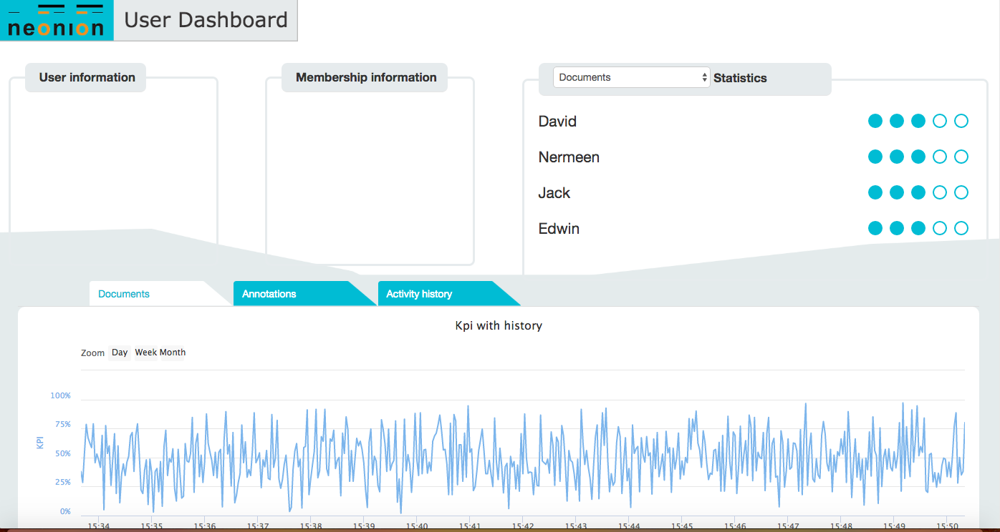

# Neonion Dashboard

##Over view

**Description**: This Demo used to show the concept Neonion Dashboard

Possible Application Scenarios:

1. Show the performance parameter of the virtual car
2. Diagnostics the virtual

  - **Technology stack**: , python 2.7.x, html5, javascript.
  - **Status**: developing

## Dependencies

1. This example was developed and tested using Python version 2.7.10. Follow the instructions to [prepare python environment](https://cto-github.cisco.com/thaton/learning-labs/blob/master/client/posts_old/files/cosc/byod.md).
2. The sample code will need a Preconfigured Flask used for RESTful APIs. Use these steps to install:

    `pip install flask`

    or `sudo pip install flask`

    If you have any further issues, visit [Flask](http://flask.pocoo.org/)
3.This sample use mongodb to store the data, how to install mongodb please see [mongodb installation](https://docs.mongodb.org/manual/installation/)

## Installation

1. Use git clone <repo URL> or download the source code onto your machine.
2. Open the terminal on your machine.
3. Navigate to the directory where you downloaded the code.
4. Launch server.
    `python server.py`
   you will be ask for inputting the the ip address of your machine 
5. Open the http://your machine ip:5003/ in your browser

